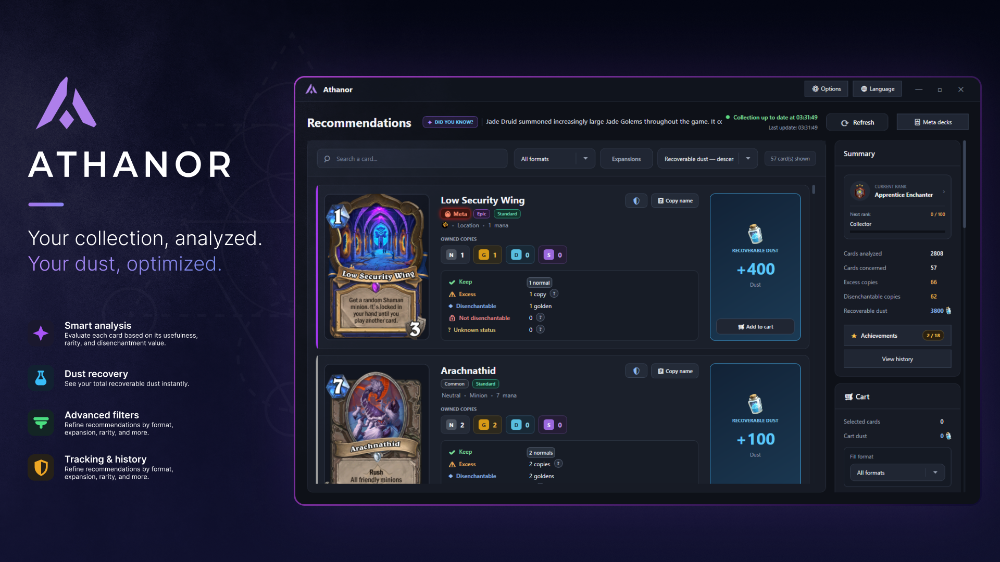
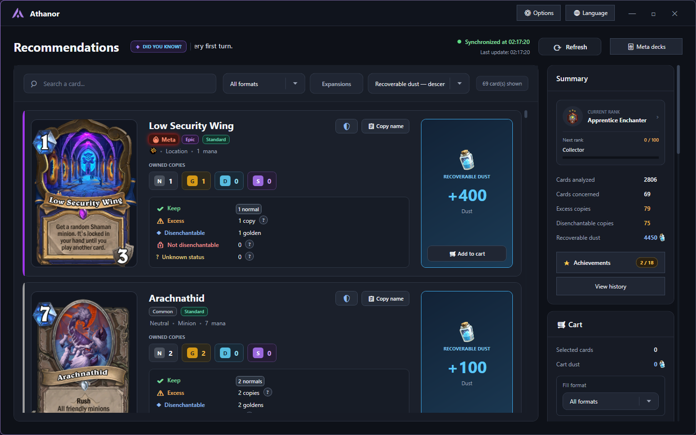
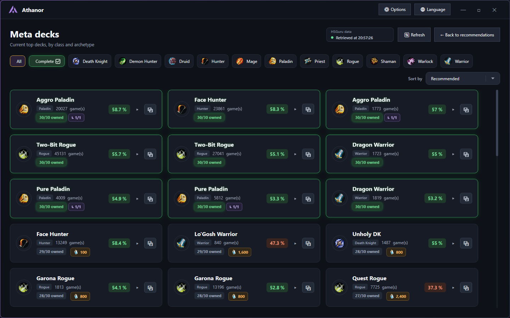

  

<h1 align="center">Athanor</h1>

  <strong>A Hearthstone collection, dust and meta companion for Windows.</strong>

  Analyse your collection, identify safe disenchanting opportunities,
  explore current meta decks and plan your Dust.

  
  

  
  
  

---

## About Athanor

Athanor is a Windows desktop companion designed to help Hearthstone players
understand and manage their card collection.

It connects to the running Hearthstone client, analyses the cards you own and
provides clear recommendations based on your collection preferences.

  

## Features

- **Live collection synchronisation** with Hearthstone
- **Safe disenchanting recommendations**
- Separate handling of **Normal, Golden, Diamond and Signature** cards
- Detection of cards that **cannot be crafted or disenchanted**
- **Arcane Dust calculations** and dust planning
- A disenchanting **cart** with a target dust amount
- Current **meta deck recommendations**
- Filters by class, rarity, format, expansion and meta relevance
- Automatic application updates
- Available in multiple languages
##

  

  

## Download

### GitHub

Download the latest Windows release:

[**Download the latest version of Athanor**](https://github.com/necrozzzzzz/ATHANOR-RELEASES/releases/latest)

### itch.io

Athanor is also available through itch.io:

[**View Athanor on itch.io**](https://nec-roz.itch.io/athanor)

Installing it through the itch.io application allows itch.io to manage future
build updates.

## Installation

1. Download the latest Windows ZIP.
2. Extract the complete archive into a folder.
3. Launch `Athanor.exe`.
4. Open Hearthstone.
5. Let Athanor synchronise your collection.

Do not launch the application directly from inside the ZIP archive.

## Automatic updates

Athanor checks for new stable releases when it starts.

When an update is available, it can download the new version, install it and
restart the application automatically.

## Requirements

- Windows 10 or Windows 11
- 64-bit operating system
- Hearthstone installed
- Hearthstone running during collection synchronisation
- Internet connection for online metadata, meta decks and updates

## Important safety notice

Athanor is designed to remain cautious when the disenchanting status of a card
cannot be confirmed.

Always review your selections before disenchanting cards inside Hearthstone.

## Disclaimer

Athanor is an independent community project.

It is not affiliated with, endorsed by or sponsored by Blizzard Entertainment.
Hearthstone and Blizzard Entertainment are trademarks or registered trademarks
of Blizzard Entertainment, Inc.
